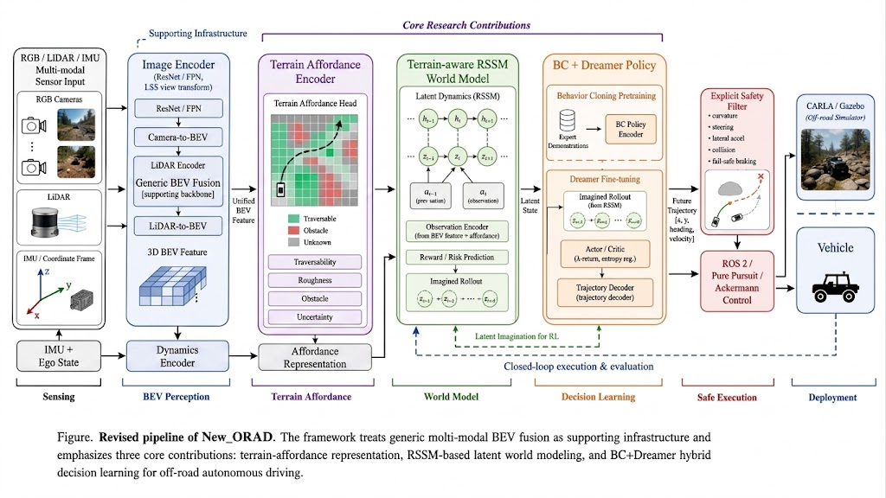

# New_ORAD

New_ORAD（Off-Road Autonomous Driving）是面向非结构化越野环境的模块化端到端自动驾驶研究项目，目标涵盖多模态 BEV 感知、隐空间世界模型、模仿学习与强化学习策略、运动学安全过滤、ROS 2 控制及 ONNX/TensorRT 部署。

> 当前状态（2026-09-04）：recorded CARLA 数据已打通 HealthGate→BEV→Policy→
> Safety→Control 离线软件链路；独立 `pure_bc_v1` 的数据、训练、评估、checkpoint
> 与 replay 路由已达到**单元验证**。现有真实 episode 不是专家数据，尚无正式
> perception/BC 权重或模型性能证据，CARLA/Gazebo、TensorRT 和车辆验收均未完成。

## 系统架构

```text
RGB / LiDAR / IMU
        │
        ▼
Perception: multi-modal BEV fusion / planned occupancy
        │
        ▼
Staged learning:
  B0  Pure BC
  B1  Affordance + BC
  B2  Affordance + RSSM + BC
  B3  BC-initialized Dreamer
        │
        ▼
Trajectory [x, y, heading, velocity]
        │
        ▼
Safety: curvature / steering / lateral-accel / collision constraints
        │  SafetySupervisor: NORMAL / DEGRADED / EMERGENCY_STOP
        │
        ▼
ROS 2 / Pure Pursuit / Ackermann control
        │
        ▼
CARLA / Gazebo / ONNX / TensorRT / vehicle deployment
```

设计基线见 [System_overview.md](./System_overview.md)，实际实现状态以审计过程文档和自动化测试为准。

## 方法 Pipeline 设计图



图中展示的是 New_ORAD 的完整目标研究链路：多模态 BEV 感知作为支撑基础，依次连接
Terrain Affordance、Terrain-aware RSSM、BC + Dreamer、显式安全过滤和车辆执行。
当前已实现程度、离线证据及尚未关闭的 Gate 以
[SmartSteer 状态总览](./docs/SmartSteer_Status.md)为准。

## 目录结构

```text
New_ORAD/
├── AGENTS.md           # 编码代理的仓库级工作约定
├── src/
│   ├── AGENTS.md       # 源码依赖、运行时契约与模型安全规则
│   ├── utils/          # 公共数据类型、Observation schema 与 frame 变换
│   ├── configuration/  # system.yaml 严格加载与全栈配置装配
│   ├── perception/     # 独立传感器编码、modality-aware BEV 融合与 heads
│   ├── affordance/     # 可通行性与地形粗糙度辅助任务
│   ├── world_model/    # 目标世界模型包；当前主要实现仍位于 policy
│   ├── policy/         # RSSM、BC/RL、actor/critic、越野 reward
│   ├── training/       # B0 专家数据、指标、训练循环与可追溯 checkpoint
│   ├── safety/         # 自行车模型、安全过滤与失效监督状态机
│   ├── sim/            # CARLA baseline、传感器、健康评估和闭环助手
│   ├── replay/         # 只读 CARLA dataset、health-first pipeline 与 artifact
│   ├── deployment/     # PyTorch → ONNX
│   ├── orad_ros2/      # Pure Pursuit 与 ROS 2 控制节点
│   └── cpp/            # TensorRT C++ API 框架
├── scripts/            # 评估 CLI
├── tests/
│   ├── AGENTS.md       # TDD、测试分层与 Mock/Fake 验收边界
│   └── ...             # unit / integration / closed_loop
├── configs/
│   ├── AGENTS.md       # 唯一配置源与严格校验规则
│   └── system.yaml     # canonical runtime configuration
├── datasets/           # 不可变 recorded episode（不作为运行配置源）
├── artifacts/          # 不可覆盖的 replay/实验证据
├── launch/             # 计划中的 ROS 2 launch，当前为空
├── docs/               # Phase 文档、部署指南与 SDD 审计
│   ├── AGENTS.md       # 文档证据、状态和日志更新规则
│   └── README.md       # 文档状态与阅读顺序索引
├── tests/README.md     # unit/integration/closed-loop 验收边界
├── src/README.md       # 包职责与单向依赖导航
└── System_overview.md  # 系统级 SDD
```

## 编码代理工作约定

项目只使用大写 `AGENTS.md` 作为长期编码代理约定，不依赖 `Agents.md` 或
`agents.md` 被自动识别。Codex 从外层到当前工作目录加载适用规则，因此根文件
保存全项目共同约束，`src/`、`tests/`、`configs/`、`docs/` 的文件只保存各自
作用域内容易出错且能够验证的规则。

个人通用偏好（例如回复语言和结果汇报形式）应放在用户级
`~/.codex/AGENTS.md`，不由本仓库维护；本仓库只记录 New_ORAD 可执行、可验证
的工程约定。

```text
AGENTS.md
├── src/AGENTS.md
├── tests/AGENTS.md
├── configs/AGENTS.md
└── docs/AGENTS.md
```

开始修改前应读取根 `AGENTS.md` 和目标路径上最近的子目录 `AGENTS.md`。
同目录若未来出现 `AGENTS.override.md`，它会取代该目录的 `AGENTS.md`，而不是
追加。架构原理、历史进度和临时需求仍分别放在 SDD/过程文档和当前对话中，
避免代理规则文件膨胀为项目百科。

参考：[官方 AGENTS.md 加载规则](https://learn.chatgpt.com/docs/agent-configuration/agents-md)、
[官方 Codex 最佳实践](https://learn.chatgpt.com/guides/best-practices)。

## 模块与实际状态

| 模块 | 已有能力 | 主要缺口 |
|---|---|---|
| `utils` | 公共类型、`Observation`、统一 `SensorHealthGate`/原因枚举、frame 变换、点云 BEV 投影 | schema version 与跨进程消息契约 |
| `configuration` | 从唯一 YAML 派生 perception/policy/safety/control/sim/health 配置，生成 byte/canonical hash 并严格校验 | 正式实验仍需 clean commit/checkpoint lineage |
| `perception` | 独立 Camera/LiDAR/IMU encoder、严格双模态健康 mask、标定感知 BEV Conv fuser、Occupancy head | 监督数据、标定误差验收与精度指标 |
| `affordance` | Traversability/Roughness 双头、masked loss、IMU 弱标签助手 | 数据标签、F1/IoU、离线泛化；默认未接入主链 |
| `world_model` | SDD 已规划 | 包为空；RSSM/WorldModel 仍在 `policy` |
| `policy` | 独立确定性 `BCPolicy`；兼容保留 Hybrid BC/RSSM/imagination/actor/critic | B0 正式权重；B1–B3 尚未实施 |
| `training` | 严格专家 manifest、HealthGate 预筛、masked metrics、冻结 perception、事务化 checkpoint、train/eval CLI | 1000+ 专家样本、3-seed 冻结 test 报告 |
| `safety` | 自行车重积分、运动学限制、碰撞截断、SafetySupervisor/fail-safe | CasADi NMPC、C++ 对等实现、环境验收 |
| `sim` | CARLA 同步传感器、前模型健康门禁、Observation、显式 occupancy、FakeRunner、健康/风险/干预指标 | 真实 CARLA/Gazebo 闭环与物理故障注入 |
| `replay` | 只读 episode 契约、HealthGate-first 网络/安全/控制回放、事务化证据 | 1000+ M0 数据、完整 provenance、标签、正式 checkpoint 指标 |
| `deployment` | 感知/策略 ONNX 导出 | ORT/TRT 数值回归、TensorRT engine |
| `orad_ros2` | Pure Pursuit、Ackermann 节点代码 | 完整依赖、节点集成测试与 launch |

## Phase 进度

以下为 2026-08-28 SDD 审计的实证口径：

| Phase | 范围 | 判断 |
|---|---|---|
| Phase 1 | 类型、几何、安全基础 | 部分完成，约 75% |
| Phase 2 | 多模态 BEV / Occupancy | 部分完成，约 60% |
| Phase 3 | IL + RL + World Model | 部分完成，约 45% |
| Phase 4 | Safety + ROS 2 | 部分完成，约 55% |
| Phase 5 | 闭环、Sim-to-Real、ONNX/TensorRT | 部分完成，约 30% |

上述百分比是 2026-08-28 的历史估计。2026-09-04 当前口径为：recorded 软件边界
`6/6` 已连通，8 个正式里程碑中关闭 `2/8`（25%），Stage 2 最低样本数量为
`200/1000`；三者分别代表接口连通、Gate 数量和样本数量，不能互相替代。详见
[当前状态总览](./docs/SmartSteer_Status.md)。

## 安装

```bash
python -m pip install -e ".[dev,perception]"
```

按需安装可选能力：

```bash
python -m pip install -e ".[deploy]"
python -m pip install -e ".[optimization]"
```

CARLA、ROS 2、Gazebo、CUDA 和 TensorRT 与系统版本高度相关，建议分别在仿真、训练和车载部署环境中安装。

## 测试

```bash
python -m pytest -v
```

2026-09-03 历史基线：

```text
300 collected
292 passed
8 skipped
16 warnings
```

同期仅运行 unit 并启用 branch coverage 的历史基线：

```text
275 passed, 2 skipped, 16 warnings
Total branch coverage: 87.93%
sensor_health.py branch coverage: 98%
```

2026-09-04 B0 实施后的最新完整回归为 `391 passed / 8 skipped / 16 warnings`；
unit 为 `372 passed / 2 skipped / 16 warnings`，全仓 branch coverage `90.29%`。
详见[当前状态总览](./docs/SmartSteer_Status.md#6-2026-09-04-验证结果)。当前仍需重点提升
sim/ROS 2/deployment 的环境路径覆盖。

分层运行：

```bash
python -m pytest tests/unit -v
python -m pytest -m integration -v
python -m pytest -m closed_loop -v
```

CPU integration 已有三条不可 skip 的 Green contract（全链路、M0 1000 样本接口
门禁和 Stage 1A 1000-case 传感器故障矩阵）。其余 integration/closed-loop skip
需要专家日志、危险边界数据集、CARLA 越野地图或 Gazebo 悬挂环境。只有这些
用例真实执行并达到以下阈值，才可声明系统级完成：

| 层级 | SDD 目标 |
|---|---|
| Unit | 几何、预处理、动力学和安全约束正确，关键分支覆盖 |
| Open-loop | 专家轨迹 ADE < 0.3 m，危险边界拦截覆盖率 100% |
| Closed-loop | 成功率 > 90%，碰撞率 0，姿态过载报警 0 |

## 核心接口

```python
from perception.bev_fusion import BEVFusion, BEVFusionConfig
from policy import BCPolicy, BCPolicyConfig
from safety.kinematic_filter import SafetyFilter, SafetyFilterConfig

perception = BEVFusion(BEVFusionConfig())
policy = BCPolicy(BCPolicyConfig())
safety = SafetyFilter(SafetyFilterConfig())
```

正式运行建议从唯一配置源装配，避免模块默认值漂移：

```python
from configuration.system import load_system_stack

stack = load_system_stack("configs/system.yaml")
perception = BEVFusion(stack.bev)
policy = BCPolicy(stack.bc_policy)
safety = SafetyFilter(stack.safety)
```

主数据 shape 契约：

```text
images:     (B, N_camera, 3, H, W)
points:     (B, N_point, 4) [x, y, z, intensity]
imu:        (B, T, 6) [ax, ay, az, gx, gy, gz]
ego:        (B, 8) [speed, steering, pitch, roll, vx, vy, yaw_rate, accel_z]
BEV:        (B, C, H=y, W=x)
trajectory: (B, N, 4) [x, y, heading, velocity]
```

## B0 Pure BC 训练与评估

B0 明确绕过 Affordance、RSSM 和 Dreamer。训练只接受 `expert_label=true` 的
episode 级冻结 split 和严格加载的 perception checkpoint；当前
`datasets/carla_initial` 为 `expert_labels=false`，会被训练入口拒绝。

```bash
PYTHONPATH=src python scripts/train_bc.py \
  --config configs/system.yaml \
  --data-manifest path/to/expert_manifest.yaml \
  --perception-checkpoint path/to/perception.pt \
  --run-dir artifacts/bc_train/<new-run> \
  --seed 41

PYTHONPATH=src python scripts/evaluate_bc.py \
  --config configs/system.yaml \
  --data-manifest path/to/expert_manifest.yaml \
  --perception-checkpoint path/to/perception.pt \
  --policy-checkpoint artifacts/bc_train/<run>/checkpoints/best.pt \
  --run-dir artifacts/bc_eval/<new-run>
```

`--smoke-test` 只用于 CPU fixture/interface 验证，产物固定标记
`model_performance_valid=false`，不能关闭 B0 离线性能 Gate。正式 B0 需 seeds
`41/42/43`、1000+ 可接受训练与验证样本、独立 test episodes，并达到
ADE `<0.30 m`、FDE `<0.60 m`、heading `<0.10 rad`、velocity `<0.50 m/s`。

## ONNX 导出

```bash
PYTHONPATH=src python -m deployment.onnx_export \
  --out-dir exports \
  --num-cameras 3 \
  --image-size 192 \
  --perception-ckpt path/to/bev.pt \
  --policy-ckpt path/to/policy.pt
```

当前导出只证明 ONNX 图可生成并通过 checker，不代表完成 ONNX Runtime/TensorRT 数值与性能验收。

## CARLA 闭环入口

Stage 1B 固定环境基线为 CARLA `0.9.16`、`Town10HD_Opt`、
`vehicle.lincoln.mkz_2020`、seed `42`。三路 Camera、LiDAR 和 IMU 的位姿及采样
参数全部由 `configs/system.yaml` 派生。在训练模型闭环前，可先执行三次纯传感器
同步基线并生成 commit/config/environment/timing 证据：

```bash
python scripts/verify_carla_baseline.py \
  --config configs/system.yaml \
  --run-id stage1b-task1-<UTC时间> --steps 100
```

当前该入口已完成单元验证，尚未在真实 CARLA server 上生成三次一致性证据。
详细边界见
[Stage 1B Task 1 记录](./docs/CARLA_STAGE1B_TASK1_BASELINE_2026-08-31.md)。

不加载 perception/policy 的正常传感器健康评估入口：

```bash
python scripts/evaluate_carla_sensor_health.py \
  --config configs/system.yaml \
  --run-id stage1b-task2-<UTC时间> \
  --warmup-ticks 20 --ticks 1000
```

该入口统计 normal CARLA stream 的 false rejection、sensor age/skew、frame/IMU
连续性和 HealthGate p50/p95。当前只有 CPU metrics/编排证据，真实阈值是否误杀
必须由 CARLA 产物回答。详见
[Stage 1B Task 2 记录](./docs/CARLA_STAGE1B_TASK2_SENSOR_HEALTH_2026-09-01.md)。

真实 recorded episode 的只读网络数据流 smoke：

```bash
python scripts/replay_carla_pipeline.py \
  --config configs/system.yaml \
  --episode datasets/carla_initial/episodes/episode_20260902T110145Z \
  --output-root artifacts/carla_replay \
  --allow-legacy-provenance \
  --allow-random-models --seed 42
```

随机模式仍只调用兼容保留的 HybridPolicy，验证 shape、finite 与 fail-safe。正式
replay 必须提供严格配对的 perception checkpoint 与 `pure_bc_v1` checkpoint，并校验
config/data/calibration/commit lineage；不兼容时严格失败，绝不降级到随机网络。

```bash
python scripts/evaluate_carla_closed_loop.py \
  --host 127.0.0.1 --port 2000 \
  --episodes 10 --max-steps 1000 \
  --goal-x 80 --goal-y 0 \
  --config configs/system.yaml \
  --perception-ckpt path/to/bev.pt \
  --policy-ckpt path/to/policy.pt \
  --occupancy-source lidar --device cuda
```

`occupancy_source` 支持 `lidar`、`learned` 和逐 cell 最大值融合的 `fused`。默认保持经过 CPU 契约验证的 `lidar`；`learned/fused` 必须在有效 perception checkpoint 和离线占用指标达标后使用。正式评估同时要求 perception/policy checkpoint。

## 当前最高优先级

- Stage 1A CPU 健康门禁已关闭；在真实 CARLA 环境完成冻结/频率/标定故障注入、
  时间戳 skew、timeout 与实际最大制动响应，关闭 Stage 1B。
- 将同一 health reason/threshold/action 契约接入 ROS 2 与 C++ 图外 runtime。
- recorded CARLA 200 帧 smoke 已打通；继续建立 1000+ 样本、冻结 split、专家标签、
  hazard/occupancy 真值，才能关闭 M0 数据门禁和危险边界验收。
- 为 Terrain Affordance 建立监督标签与 F1/IoU 门槛，达标前保持默认关闭。
- B0 软件边界已达到单元验证；下一步获取 1000+ 正式专家轨迹与 perception
  checkpoint，完成 seeds `41/42/43` 的冻结 test ADE/FDE 基线，再启动 B1。
- 增加 PyTorch→ONNX Runtime→TensorRT 数值一致性与目标硬件时延验收。

完整 P0/P1/P2 清单见最新审计报告。

建议 TDD 质量门槛：

```text
全项目 branch coverage：不得低于 79% 门槛，最新实测见状态总览
核心 safety branch coverage：≥95%
新增/修改代码 coverage：≥95%
P0 fail-safe 分支：100%
CPU integration contract tests：不得 skip
```

## 文档索引

- [文档阅读顺序与状态索引](./docs/README.md)
- [技术原理与代码架构](./docs/技术原理与代码架构.md)
- [系统 SDD](./System_overview.md)
- [Phase 1/2 过程报告](./docs/PHASE2_PROGRESS_REPORT.md)
- [Phase 3/4 过程报告](./docs/PHASE3_PHASE4_PROGRESS.md)
- [Phase 5 部署指南](./docs/PHASE5_DEPLOYMENT_GUIDE.md)
- [2026-08-28 SDD 深度审计](./docs/SDD_AUDIT_2026-08-28.md)
- [2026-08-28 TDD 严格检验与覆盖率盘点](./docs/TDD_AUDIT_2026-08-28.md)
- [2026-08-28 P0/P1/P2 整改报告](./docs/SDD_REMEDIATION_2026-08-28.md)
- [2026-08-29 方法框架 SDD/TDD 跟进记录](./docs/METHOD_FRAMEWORK_REMEDIATION_2026-08-29.md)
- [2026-08-30 OffTerSim/UniAD 参考架构整改记录](./docs/REFERENCE_ARCHITECTURE_REMEDIATION_2026-08-30.md)
- [2026-08-30 四项目与 BEVFusion/仓库结构整改记录](./docs/BEVFUSION_REPOSITORY_REMEDIATION_2026-08-30.md)
- [2026-08-31 Sensing/BEV 严格双模态有效性整改记录](./docs/SENSING_BEV_STRICT_VALIDATION_2026-08-31.md)
- [2026-08-31 Stage 1A 传感器健康门禁完成记录](./docs/SENSOR_HEALTH_STAGE1A_2026-08-31.md)
- [工程执行路线与六阶段 Exit Gate](./docs/ENGINEERING_EXECUTION_ROADMAP.md)

## 定期审计约定

后续报告使用 `docs/SDD_AUDIT_YYYY-MM-DD.md`，记录代码基线、测试实跑、跳过项、接口变化、P0/P1/P2、Phase 成熟度和交付证据。状态统一分为：

```text
代码骨架 → 单元验证 → 离线验证 → 仿真闭环 → 实车验证
```

只有具备对应层级的可复现证据，才将能力标为该层级完成。

## 安全声明

本项目当前用于研究、原型验证和工程开发。未经完整 SIL/HIL、封闭场地测试、车辆级功能安全分析和独立安全审查，不得直接用于开放道路或载人车辆控制。
